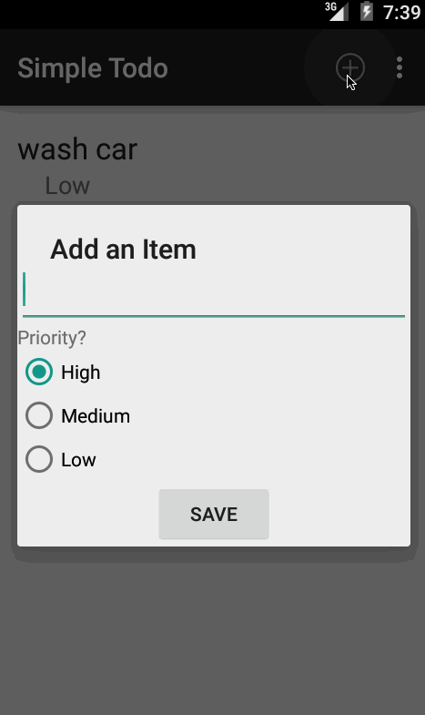

# Simple ToDo App
This is the Codepath initial Todo App for the Android Bootcamp. 

Initial Requirements took about 2 hours to complete.

You can use this application to:
- Create Todo List Items
- Edit existing Todo items
- Give and edit priorites to List Items

### Walkthrough 

### Features
Requirements Complete:
* [x] Can add and remove items from list
* [x] Can edit items in list
* [x] Items persist via file read and write
* [x] Code pushed to Github
* [x] Readme and GIF walkthrough
* [x] Issue created

Extensions Added:
* [x] Added Priority feature
* [x] Changed backend to SQLite
* [x] Custom adapter (Item with Priority)
* [x] Use DialogFragment instead of Activity

